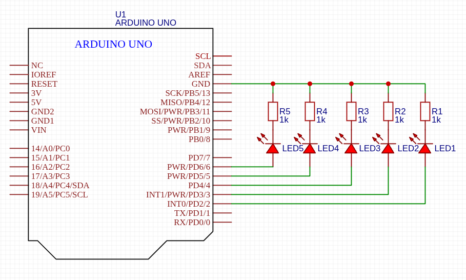

### Pertanyaan 1A <hr>
1. Pada kondisi apa program masuk ke blok if?

    >Ketika nilai timeDelay kurang dari sama dengan 100

2. Pada kondisi apa program masuk ke blok else?

    >Apabila timeDelay memiliki nilai lebih dari 100

3. Apa fungsi dari perintah delay(timeDelay)?

    >Memberikan jeda diantara perintah dengan durasi waktu sebesar nilai variable timeDelay ms

4. Jika program yang dibuat memiliki alur mati → lambat → cepat → reset (mati),
ubah menjadi LED tidak langsung reset → tetapi berubah dari cepat → sedang →
mati dan berikan penjelasan disetiap baris kode nya dalam bentuk README.md!

    ```c
    const int ledPin = 6;        // variable constant dengan nilai pin digital 6
    int timeDelay = 1000;        // inisial waktu delay
    bool delayState = false;     // kondisi untuk menambahkan atau mengurangi delay
    
    void setup() {
        pinMode(ledPin, OUTPUT);    // pin digital 6 diset ke mode OUTPUT
        Serial.begin(9600);         // menyalakan serial untuk alat bantu debugging
    }
    
    void loop() {
      digitalWrite(ledPin, HIGH);   // Nyalakan LED
      delay(timeDelay);             // Memberikan delay selama nilai dari timeDelay
      
      digitalWrite(ledPin, LOW);    // Matikan LED
      delay(timeDelay);
      
      if (delayState) {             // Kondisi apabila state delay = true
        timeDelay += 100;           // maka tambahkan delay sebanyak 100.
        if (timeDelay >= 1000) {    // Jika timeDelay memiliki nilai lebih dari sama dengan 1000,
          delayState = false;       // matikan delayState
          delay(3000);              // lalu beri jeda selama 3 detik sebagai gambaran reset/mati
        }
      } else if (!delayState) {     // Kondisi apabila state delay = false
        timeDelay -= 100;           // maka kurangi delay sebanyak 100.
        if (timeDelay <= 100) delayState = true;    // Jika timeDelay kurang dari 100, nyalakan delayState.
      }
    
      Serial.println(timeDelay);    // untuk print nilai timeDelay ke serial
    }
    ```

### Pertanyaan 2A <hr>
1. Gambarkan rangkaian schematic 5 LED running yang digunakan pada percobaan!

    

2. Jelaskan bagaimana program membuat efek LED berjalan dari kiri ke kanan!

    >Dengan menggunakan pengulangan, indeks ledPin yang di inisialisasi dengan nilai 7 akan menyalakan led pada pin 7 lalu terdapat jeda sebelum akhirnya led tersebut dimatikan.
    Setelah itu nilai ledPin akan di kurangkan/decrement sebanyak satu nilai dan mengulai rangkaian perintah tersebut hingga kondisi ledPin lebih besar dari sama dengan 2.

3. Jelaskan bagaimana program membuat LED kembali dari kanan kek kiri!

    >Sama seperti sebelumnya, dengan perubahan ledPin di inisialisasi dengan nilai 2 lalu menjalankan semua perintahnya dan mengulang lagi dengan penambahan/increment nilai ledPin sebanyak 1.
    Pengulangan akan terjadi terus hingga kondisi ledPin lebih dari 7.

5. Buatkan program agar LED menyala tiga LED kanan dan tiga LED kiri secara bergantian dan berikan penjelasan disetiap baris kode nya dalam bentuk README.md!

    ```c
    int timer = 100;    // variable delay.

    void setup() {
      for (int ledPin = 2; ledPin < 8; ledPin++) {    // pengulangan untuk otomasi set mode pin.
      	pinMode(ledPin, OUTPUT);
      }
    }
    void loop() {
      for (int ledPin = 2; ledPin <= 4; ledPin++) {   // pengulangan untuk menyalakan 3 led sebelah kanan.
        digitalWrite(ledPin, HIGH);
      }
      
      delay(timer);                                   // delay selama nilai timer.
      
      for (int ledPin = 2; ledPin <= 4; ledPin++) {   // pengulangan untuk mematikan 3 led sebelah kanan.
        digitalWrite(ledPin, LOW);
      }
      
      for (int ledPin = 7; ledPin >= 5; ledPin--) {   // pengulangan untuk menyalakan 3 led sebelah kiri.
        digitalWrite(ledPin, HIGH);
      }
      
      delay(timer);                                   // delay selama nilai timer.
      
      for (int ledPin = 7; ledPin >= 5; ledPin--) {   // pengulangan untuk mematikan 3 led sebelah kiri.
        digitalWrite(ledPin, LOW);
      }
    }
    ```
