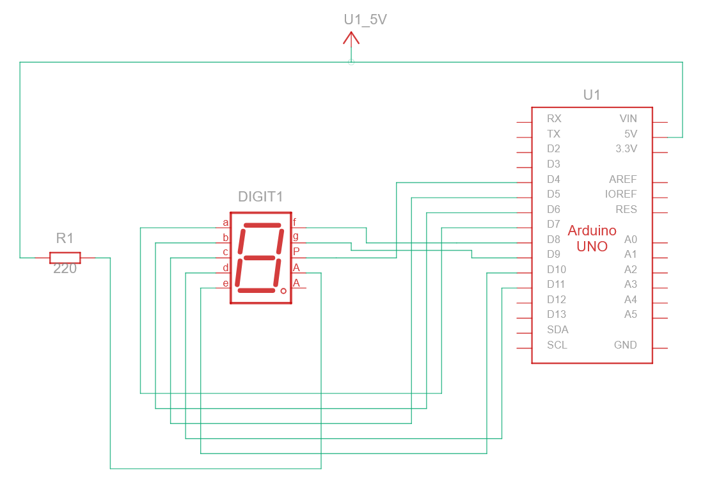
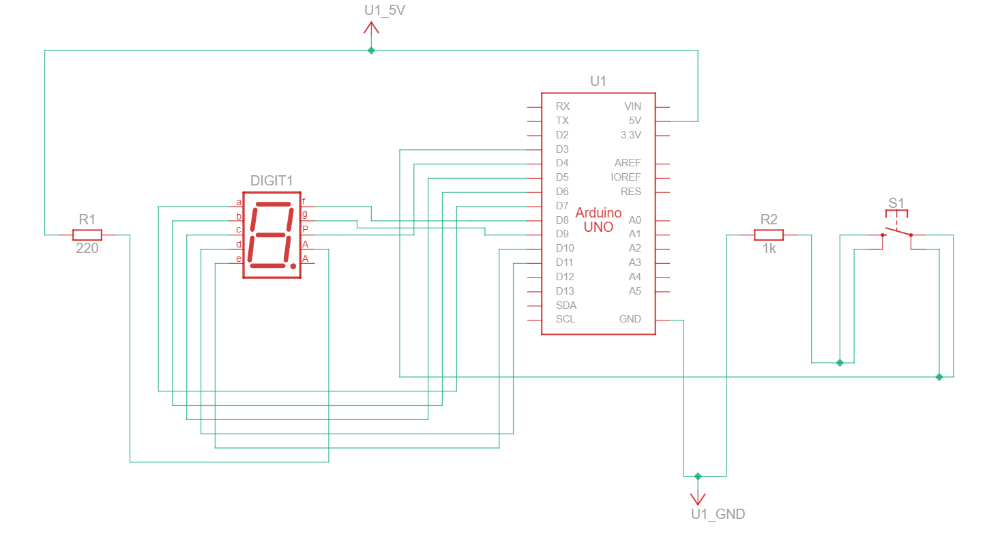

### Percobaan 2A <hr>
1. Gambarkan rangkaian schematic yang digunakan pada percobaan!

    

2. Apa yang terjadi jika nilai num lebih dari 15?

    >7-segment tidak akan menampilkan pattern apapun dari array digitPattern bahkan bisa tidak ada LED yang menyala

3. Apakah program ini menggunakan common cathode atau common anode? Jelaskan alasanya!

    >Common anode, karena pin common pada 7-segment terhubung pada VCC untuk bisa menyala dan ketika ingin menyalakan LED maka pin harus di tulis LOW

4. Modifikasi program agar tampilan berjalan dari F ke 0 dan berikan penjelasan disetiap baris kode nya dalam bentuk README.md!

    ```cpp
    // 7-Segment Common Anode

    // Pin mapping segment: a b c d e f g dp
    // Array yang berisi pin dari pinout masing-masing segment
    const int segmentPins[8] = {7, 6, 5, 11, 10, 8, 9, 4};

    // Array 2D yang menyimpan pola angka dan huruf
    byte digitPattern[16][8] = {
      {1,1,1,1,1,1,0,0}, //0
      {0,1,1,0,0,0,0,0}, //1
      {1,1,0,1,1,0,1,0}, //2
      {1,1,1,1,0,0,1,0}, //3 
      {0,1,1,0,0,1,1,0}, //4
      {1,0,1,1,0,1,1,0}, //5
      {1,0,1,1,1,1,1,0}, //6
      {1,1,1,0,0,0,0,0}, //7
      {1,1,1,1,1,1,1,0}, //8
      {1,1,1,1,0,1,1,0}, //9
      {1,1,1,0,1,1,1,0}, //A
      {0,0,1,1,1,1,1,0}, //b
      {1,0,0,1,1,1,0,0}, //C
      {0,1,1,1,1,0,1,0}, //d
      {1,0,0,1,1,1,1,0}, //E
      {1,0,0,0,1,1,1,0}  //F
    };

    // Fungsi tampil digit (dibalik untuk CA)
    void displayDigit(int num)
    {
      // pengulangan untuk menyalakan seluruh LED sesuai dengan pola
      for(int i=0; i<8; i++)
      {
        digitalWrite(segmentPins[i], !digitPattern[num][i]); // <-- dibalik
      }
    }

    void setup()
    {
      // set semua pin ke OUTPUT
      for(int i=0; i<8; i++)
      {
        pinMode(segmentPins[i], OUTPUT);
      }
    }

    void loop()
    {
      // pengulangan untuk menampilkan pola dari F ke 0 pada 7-segment
      for(int i=15; i>=0; i--)
      {
        displayDigit(i);  // memanggil fungsi displayDigit dengan parameter i
        delay(1000);      // jeda 1 detik.
      }
    }
    ```

### Percobaan 1B <hr>
1. Gambarkan rangkaian schematic 5 LED running yang digunakan pada percobaan!

    

2. Mengapa pada push button digunakan mode INPUT_PULLUP pada Arduino Uno? Apa keuntungannya dibandingkan rangkaian biasa?

    >mode INPUT_PULLUP digunakan untuk membuat button sebagai input dan mengaktifkan resistor pullup internal pada pin, sehingga pin tersebut akan membaca nilai HIGH stabil sebagai defaultnya. Salah satu keuntungannya adalah menghindari sinyal noise yang terjadi apabila button tidak ditekan (floating) dan juga mengurangi penggunaan resistor eksternal.

3. Jika salah satu LED segmen tidak menyala, apa saja kemungkinan penyebabnya dari sisi hardware maupun software?

    >Salah satu penyebabnya adalah kesalahan sambungan pin pada pinout baik dari sambungan kabel jumper maupun konfigurasi setup pada program yang terbalik. Kerusakan yang lain di sisi hardware adalah LED yang sudah rusak sehingga tidak bisa dinyalakan.

4. Modifikasi rangkaian dan program dengan dua push button yang berfungsi sebagai penambahan (increment) dan pengurangan (decrement) pada sistem counter dan berikan penjelasan disetiap baris kode nya dalam bentuk README.md!

    ```cpp
    // Pin 7-Segment (a b c d e f g dp)
    // Array yang berisi pin dari pinout masing-masing segment
    const int segmentPins[8] = {7, 6, 5, 11, 10, 8, 9, 4};

    // Push button
    const int buttonPinInc = 3; // pin untuk button increment
    const int buttonPinDec = 12;// pin untuk button decrement

    // Counter
    int counter = 0;  // variable untuk menghitung berapa kali button ditekan

    // State button
    bool lastButtonState = HIGH;  // nilai awal lastButtonState adalah HIGH

    // Pola digit 0-F
    // Array 2D yang menyimpan pola angka dan huruf
    byte digitPattern[16][8] = {
      {1,1,1,1,1,1,0,0}, //0
      {0,1,1,0,0,0,0,0}, //1
      {1,1,0,1,1,0,1,0}, //2
      {1,1,1,1,0,0,1,0}, //3
      {0,1,1,0,0,1,1,0}, //4
      {1,0,1,1,0,1,1,0}, //5 
      {1,0,1,1,1,1,1,0}, //6
      {1,1,1,0,0,0,0,0}, //7
      {1,1,1,1,1,1,1,0}, //8
      {1,1,1,1,0,1,1,0}, //9
      {1,1,1,0,1,1,1,0}, //A
      {0,0,1,1,1,1,1,0}, //b
      {1,0,0,1,1,1,0,0}, //C
      {0,1,1,1,1,0,1,0}, //d
      {1,0,0,1,1,1,1,0}, //E
      {1,0,0,0,1,1,1,0}  //F
    };

    // Tampilkan digit
    void displayDigit(int num)
    {
      // pengulangan untuk menyalakan seluruh LED sesuai dengan pola
      for(int i=0; i<8; i++)
      {
        digitalWrite(segmentPins[i], !digitPattern[num][i]);
      }
    }

    void setup()
    {
      // set semua pin LED ke output
      for(int i=0; i<8; i++)
      {
        pinMode(segmentPins[i], OUTPUT);
      }

      // set kedua pin button ke INPUT_PULLUP
      pinMode(buttonPinInc, INPUT_PULLUP);
      pinMode(buttonPinDec, INPUT_PULLUP);

      displayDigit(counter); // tampilkan awal
    }

    void loop()
    {
      // membaca nilai awal button input
      // ditekan -> LOW
      bool currentButtonIncState = digitalRead(buttonPinInc);
      bool currentButtonDecState = digitalRead(buttonPinDec);

      // deteksi tekan (HIGH -> LOW)
      // hanya berjalan sekali karena saat tombol ditekan dan ditahan,
      // lastButtonState akan menyimpan nilai LOW
      if (lastButtonState == HIGH)
      {
        if(currentButtonIncState == LOW) counter++; // naikan counter apabile button increment ditekan
        if(currentButtonDecState == LOW) counter--; // turunkan counter apabila button decrement ditekan
        if(counter > 15) counter = 0; // reset counter ke 0 bila melebihi 15
        if(counter < 0) counter = 15; // reset counter ke 15 bila kurang dari 0

        displayDigit(counter); // update hanya saat ditekan

        delay(200); // debounce sederhana
      }

      // memastikan nilai lastButtonState hanya akan HIGH apabila tidak ada button yang ditekan
      lastButtonState = currentButtonIncState && currentButtonDecState;
    }
    ```
