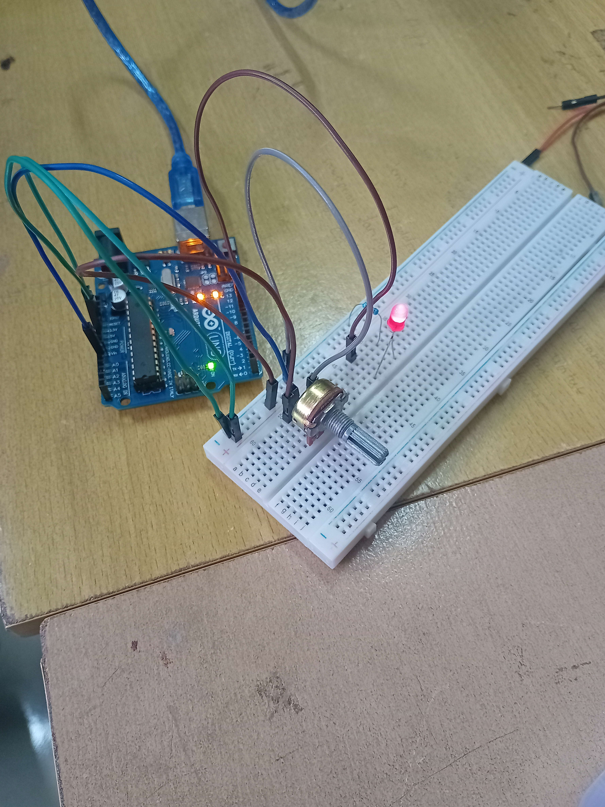

#  Dokumentasi

<div align="center">
    
    
    
    <br>
    
</div>

#  Pertanyaan Praktikum
###  Percobaan 1 (4A)<hr>
1. Apa fungsi perintah analogRead() pada rangkaian praktikum ini?

    >Fungsi tersebut digunakan untuk membaca nilai analog dari sebuah potensiometer dan dikonversi menjadi digital, sehingga parameter fungsi tersebut mengarah ke pin potensio yaitu A0.

2. Mengapa diperlukan fungsi map() dalam program tersebut?

    >Fungsi map() mempermudah kita dalam mengkonversi antar rentang. Misal 0-1023 merupakan 0%-100% dan 0°-180° juga merupakan 0%-100%, maka ketika nilai input pada map yaitu varibel val berubah, outputnya (sudut servo) akan mengikuti rentang (%) dari input tersebut.

3. Modifikasi program berikut agar servo hanya bergerak dalam rentang 30° hingga 150°, meskipun potensiometer tetap memiliki rentang ADC 0–1023. Jelaskan program pada file README.md

    ```cpp
    ...
    void loop() {
    
      // ===================== PEMBACAAN ADC =====================
      // Baca nilai dari potensiometer (rentang 0–1023)
      val = analogRead(potensioPin); // isi dengan potensioPin
    
      // ===================== KONVERSI DATA =====================
      // Ubah nilai ADC menjadi sudut servo (0–180 derajat)
      // Untuk mengubah rentang servo menjadi 30° - 150°, cukup ubah saja sudut minimum dan maksimum servo pada fungsi map().
      // Sehingga meskipun nilai input dari ADC masih dalam rentang 0-1023, map masih bisa mengkonversi rentang tersebut menjadi sudut servo dalam rentang 30°-150°.
      pos = map(val,
                 0,   	// isi nilai minimum ADC
                 1023,  // isi nilai maksimum ADC
                 30,   	// isi sudut minimum servo  (ubah dari 0° menjadi 30°)
                 150);  // isi sudut maksimum servo (ubah dari 180° menjadi 150°)
    ...
    }
    ```

### Percobaan 2 (4B)<hr>
1. Jelaskan mengapa LED dapat diatur kecerahannya menggunakan fungsi analogWrite()!

    >Karena fungsi tersebut menghasilkan sinyal PWM yang membuat LED menyala dan mati dengan cepat dalam siklus waktu tertentu. Seiring potensio dinaikkan, lebar pulsa juga akan terus melebar dan membuat LED tampak lebih terang.

2. Apa hubungan antara nilai ADC (0–1023) dan nilai PWM (0–255)?

    >ADC dan PWM sama-sama menggunakan binary digit, nilai ADC merupakan 8-bit sedangkan PWM menggunakan 10-bit. Nilai PWM merupakan hasil dari pembagian nilai ADC, yaitu ADC / 4. Sehingga nilai ADC yang lebih besar akan menghasilkan duty cycle yang lebih besar.

3. Modifikasilah program berikut agar LED hanya menyala pada rentang kecerahan sedang, yaitu hanya ketika nilai PWM berada pada rentang 50 sampai 200. Jelaskan program pada file README.md.
    ```cpp
    ...
    void loop() {

      // ===================== PEMBACAAN SENSOR =====================
      // Baca nilai analog dari potensiometer (rentang 0–1023)
      nilaiADC = analogRead(potPin); // isi dengan potPin
    
      // ===================== PEMROSESAN DATA (SCALING) =====================
      // Ubah nilai ADC (0–1023) menjadi nilai PWM (0–255)
      pwm = map(nilaiADC,
                0,   // isi nilai minimum ADC
                1023,   // isi nilai maksimum ADC
                0,   // isi PWM minimum
                255);  // isi PWM maksimum
    
      // ===================== OUTPUT PWM =====================
      // Kirim sinyal PWM ke LED (mengatur kecerahan)
      // Untuk menyalakan LED ketika PWM dalam rentang 50-200, gunakan percabangan
      if (pwm <= 200 && pwm >=50) // Ketika pwm == 50-200
      	analogWrite(ledPin, pwm); // Nyalakan LED dengan nilai pwm
      else
        analogWrite(ledPin, 0);   // Diluar rentang tersebut LED akan mati
    ...
    }
    ```
