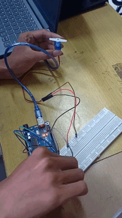
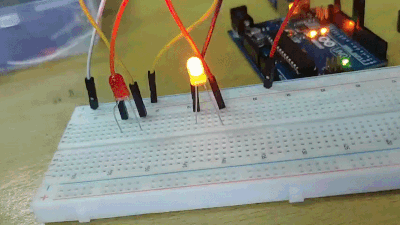

#  Dokumentasi

<div align="center">
    
    
    
    <br>
    
</div>

#  Pertanyaan Praktikum
###  Percobaan 1 (5A)<hr>
1. Apakah ketiga task berjalan secara bersamaan atau bergantian? Jelaskan mekanismenya!

    >Ketiga task pada program FreeRTOS berjalan secara bergantian (concurrent), bukan benar-benar paralel. Arduino Uno hanya memiliki satu inti prosesor sehingga CPU mengeksekusi task satu per satu dengan sangat cepat. Pergantian task diatur oleh scheduler FreeRTOS berdasarkan prioritas dan waktu delay yang diberikan menggunakan fungsi vTaskDelay().
    >
    >Pada program:
    >
    > -TaskBlink1 mengontrol LED pertama.
    >
    >
    > -TaskBlink2 mengontrol LED kedua.
    >
    > -Taskprint menampilkan counter pada Serial Monitor.
    >
    >Ketika suatu task menjalankan vTaskDelay(), scheduler akan memberikan kesempatan kepada task lain untuk dieksekusi. Mekanisme ini menciptakan efek multitasking sehingga seluruh task terlihat berjalan secara bersamaan.

2. Bagaimana cara menambahkan task keempat? Jelaskan langkahnya!

    >Untuk menambahkan task keempat pada program FreeRTOS, pertama perlu dibuat sebuah fungsi baru yang akan dijadikan task tambahan. Fungsi tersebut berisi proses yang ingin dijalankan, misalnya menampilkan teks pada Serial Monitor atau mengontrol perangkat lain seperti sensor dan LED. Setelah fungsi task dibuat, nama fungsi tersebut perlu dideklarasikan pada bagian atas program agar dapat dikenali oleh compiler.
    >
    >Langkah berikutnya adalah menambahkan fungsi xTaskCreate() di dalam setup(). Fungsi ini digunakan untuk mendaftarkan task baru ke scheduler FreeRTOS. Pada bagian ini ditentukan nama task, ukuran memori stack, prioritas task, dan parameter lainnya. Setelah task berhasil dibuat, scheduler FreeRTOS akan secara otomatis mengatur eksekusi task keempat bersama task-task lain yang sudah ada.
    >
    >Dengan penambahan task baru, sistem dapat menjalankan lebih banyak proses secara concurrent tanpa harus mengubah struktur utama program. Hal ini menunjukkan bahwa RTOS memiliki fleksibilitas tinggi dalam pengembangan sistem multitasking pada mikrokontroler.

3. Modifikasilah program dengan menambah sensor (misalnya potensiometer), lalu gunakan nilainya untuk mengontrol kecepatan LED! Bagaimana hasilnya? Jelaskan program pada file README.md.

    ```cpp
    #include <Arduino_FreeRTOS.h>
    
    // Deklarasi task LED
    void TaskLED(void *pvParameters);
    
    void setup() {
    
      // Memulai komunikasi serial
      Serial.begin(9600);
    
      // Membuat task LED
      xTaskCreate(
        TaskLED,   // Nama fungsi task
        "LED",     // Nama task
        128,       // Ukuran stack
        NULL,      // Parameter task
        1,         // Prioritas task
        NULL       // Task handle
      );
    }
    
    void loop() {
      // Loop dikosongkan karena semua proses
      // dijalankan oleh FreeRTOS
    }
    
    void TaskLED(void *pvParameters) {
    
      // Pin 8 digunakan sebagai output LED
      pinMode(8, OUTPUT);
    
      while(1) {
    
        // Membaca nilai analog dari potensiometer pada pin A0
        int sensor = analogRead(A0);
    
        // Mengubah nilai sensor menjadi delay LED
        // Semakin besar nilai sensor, semakin lambat kedipan LED
        int delayLED = map(sensor, 0, 1023, 100, 1000);
    
        // Menyalakan LED
        digitalWrite(8, HIGH);
    
        // Delay sesuai nilai potensiometer
        vTaskDelay(delayLED / portTICK_PERIOD_MS);
    
        // Mematikan LED
        digitalWrite(8, LOW);
    
        // Delay kembali
        vTaskDelay(delayLED / portTICK_PERIOD_MS);
    
        // Menampilkan nilai delay ke Serial Monitor
        Serial.println(delayLED);
      }
    }
    ```

### Percobaan 2 (5B)<hr>
1. Apakah kedua task berjalan secara bersamaan atau bergantian? Jelaskan mekanismenya!

    >Kedua task pada program tersebut berjalan secara bergantian (concurrent), bukan benar-benar paralel. Hal ini karena Arduino Uno hanya memiliki satu inti prosesor sehingga task dieksekusi satu per satu oleh CPU. Namun, FreeRTOS menggunakan scheduler untuk mengatur pergantian task dengan sangat cepat sehingga task terlihat berjalan secara bersamaan.
    >
    >Pada program, task read_data bertugas mengirim data temperatur dan humidity ke queue menggunakan xQueueSend(). Sementara itu, task display bertugas menerima data dari queue menggunakan xQueueReceive() lalu menampilkannya pada Serial Monitor. Ketika task read_data memasuki delay menggunakan vTaskDelay(100), scheduler akan memberikan kesempatan kepada task display untuk berjalan. Mekanisme inilah yang membuat kedua task dapat bekerja secara teratur dan responsif.

2.  Apakah program ini berpotensi mengalami race condition? Jelaskan!

    >Program ini memiliki kemungkinan race condition yang sangat kecil karena komunikasi antar-task menggunakan queue FreeRTOS. Queue berfungsi sebagai media pertukaran data yang aman sehingga task tidak mengakses data yang sama secara langsung pada waktu bersamaan.
    >
    >Pada program ini, task read_data hanya mengirim data ke queue, sedangkan task display hanya menerima data dari queue. Sinkronisasi pengiriman dan penerimaan data sudah diatur oleh FreeRTOS sehingga konflik akses data dapat dihindari. Oleh karena itu, penggunaan queue jauh lebih aman dibandingkan penggunaan variabel global tanpa mekanisme sinkronisasi.
    >
    >Race condition biasanya terjadi apabila beberapa task membaca dan menulis variabel yang sama secara bersamaan tanpa protection seperti mutex atau semaphore. Karena program ini menggunakan queue, risiko tersebut dapat diminimalkan.

3. Modifikasilah program dengan menggunakan sensor DHT sesungguhnya sehingga informasi yang ditampilkan dinamis. Bagaimana hasilnya? Jelaskan program pada file README.md.
    ```cpp
    #include <Arduino_FreeRTOS.h>
    #include <queue.h>
    #include <DHT.h>
    
    // Menentukan pin dan tipe sensor DHT
    #define DHTPIN 2
    #define DHTTYPE DHT11
    
    // Membuat objek DHT
    DHT dht(DHTPIN, DHTTYPE);
    
    // Struktur data queue
    struct readings{
      float temp;
      float h;
    };
    
    // Handle queue
    QueueHandle_t my_queue;
    
    // Deklarasi task
    void read_data(void *pvParameters);
    void display(void *pvParameters);
    
    void setup() {
    
      // Memulai serial monitor
      Serial.begin(9600);
    
      // Memulai sensor DHT
      dht.begin();
    
      // Membuat queue
      my_queue = xQueueCreate(1, sizeof(struct readings));
    
      // Membuat task pembaca sensor
      xTaskCreate(read_data, "read sensors", 128, NULL, 1, NULL);
    
      // Membuat task display
      xTaskCreate(display, "display", 128, NULL, 1, NULL);
    }
    
    void loop() {
      // Loop dikosongkan karena seluruh proses
      // dijalankan oleh FreeRTOS
    }
    
    // Task membaca data sensor
    void read_data(void *pvParameters){
    
      struct readings x;
    
      for(;;){
    
        // Membaca suhu dari sensor DHT
        x.temp = dht.readTemperature();
    
        // Membaca kelembapan dari sensor DHT
        x.h = dht.readHumidity();
    
        // Mengirim data ke queue
        xQueueSend(my_queue, &x, portMAX_DELAY);
    
        // Delay pembacaan sensor
        vTaskDelay(1000 / portTICK_PERIOD_MS);
      }
    }
    
    // Task menampilkan data
    void display(void *pvParameters){
    
      struct readings x;
    
      for(;;){
    
        // Menerima data dari queue
        if(xQueueReceive(my_queue, &x, portMAX_DELAY) == pdPASS){
    
          // Menampilkan suhu
          Serial.print("temp = ");
          Serial.println(x.temp);
    
          // Menampilkan kelembapan
          Serial.print("humidity = ");
          Serial.println(x.h);
    
          Serial.println("----------------");
        }
      }
    }
    ```
